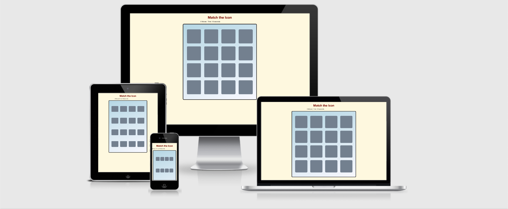

<h1 align="center">Match The Icon</h1>

Milestone Project 2: Interactive Frontend Development Milestone Project  - Code Institute

The purpose of this project is to create a single player matching memory game. I created a memory game where upon clicked, two cards match and stay open. Once all cards are matched, a popup message appears and congratulates the tester for winning the game. The popup gives a score from 1 to 3, how much time it took, and how many moves it took to finish the game. This game is suitable for any ages. 

[Live Demo](https://birchm93.github.io/Project2/)

<h2 align="center"></h2>

## How to Play:

* The goal is to match all the cards together and win the game.

1. Start by clicking on two cards, if they match, look for another pair of cards. If cards are not a pair, try again.

2. Keep matching up pairs until all cards are matched and faced up. 

3. Congratulations, you win! An alert window appears tell you your score, time, and moves it took to complete the game. 

4. On the Alert window, you can hit 'Go Again!' to have another go at the game.

## User Experience (UX)

-   ### User stories

    -   As a user, I want a memory game where I have to match identical cards.
    -   As a user, whenever I click on a card, I expect it to flip with an icon appearing.
    -   As a user, when I click on two matching cards, they should both stay flipped.
    -   As a user, if the cards don't match, both cards should flip back.
    -   As a user, I shouldn't be able to click on the same card twice.
    -   As a user, the turns counter should increase every time I flip two cards.
    -   As a user, If all cards are matched I expect a message notifying me of my total score.

*   ### Wireframes

    -   [View]()

## Features

-   #### User Interface
    

    -   Timer - starts when the site is opened.
    -   Flips - number of moves displayed after clicking on two cards.
    -   Restart button - if the user needs to start again.
    -   Responsive card tiles.

## Technologies Used

### Languages Used

-   [HTML5](https://en.wikipedia.org/wiki/HTML5)
-   [CSS3](https://en.wikipedia.org/wiki/Cascading_Style_Sheets)
-   [Javascript](https://en.wikipedia.org/wiki/JavaScript)

### Frameworks, Libraries & Programs Used

1. [Bootstrap 3.3.7:](https://getbootstrap.com/docs/3.3/getting-started/)
    - Bootstrap was used to assist with the responsiveness and styling of the website.
1. [Font Awesome:](https://fontawesome.com/icons?d=gallery)
    - Font Awesome was used to add icons for UX purposes.
1. [GitHub:](https://github.com/)
    - GitHub is used to store the project's code after being pushed from Git.
1. [Balsamiq:](https://balsamiq.com/)
    - Balsamiq was used to create wireframes during the design process.

## Testing

### Code Validation
-   [W3C Markup Validator](https://validator.w3.org/) - No errors found.
-   [W3C CSS Validator](https://jigsaw.w3.org/css-validator/#validate_by_input) - No errors were found.
-   [Esprima Javascript Validator](https://esprima.org/demo/validate.html) - Code is valid.

## Deployment

### GitHub Pages

The project was deployed to GitHub Pages using the following steps...

1. Log in to GitHub and locate the [GitHub Repository](https://github.com/BirchM93/Project2)
2. At the top of the Repository (not top of page), locate the "Settings" button on the menu.
3. Scroll down the Settings page until you locate the "GitHub Pages" Section.
4. Under "Source", click the dropdown called "None" and select "Master Branch".
5. The page will automatically refresh.
6. Scroll back down through the page to locate the now published site [link](https://birchm93.github.io/Project2/) in the "GitHub Pages" section.

### Making a Local Clone

1. Log in to GitHub and locate the [GitHub Repository](https://github.com/BirchM93/Project2)
2. Under the repository name, click "Clone or download".
3. To clone the repository using HTTPS, under "Clone with HTTPS", copy the link.
4. Open Git Bash
5. Change the current working directory to the location where you want the cloned directory to be made.
6. Type `git clone`, and then paste the URL you copied in Step 3.
7. Press Enter. Your local clone will be created.

## Credits

### Content

-   The code was inspired from the following [tutorial](https://www.youtube.com/watch?v=Nik1E9HdrsI)

### Media

-   [Card Icons](https://fontawesome.com/icons?d=gallery)

### Acknowledgements

-   My mentor Aaron for continuous helpful feedback.

-   Tutor support at Code Institute for their continuous support.
