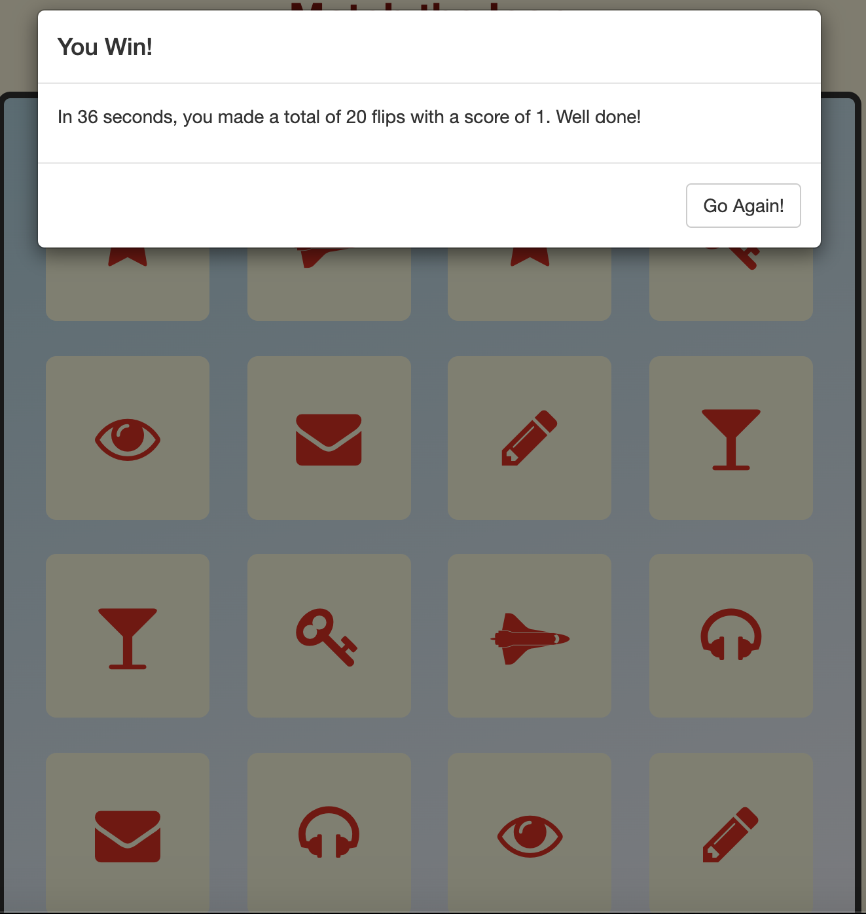

<h1 align="center">Match The Icon</h1>

Milestone Project 2: Interactive Frontend Development Milestone Project  - Code Institute

The purpose of this project is to create a single-player matching memory game. I created a memory game whereupon clicked, two cards match and stay open. Once all cards are matched, a popup message appears and congratulates the tester for winning the game. The popup gives a score from 1 to 3, how much time it took, and how many moves it took to finish the game. This game is suitable for any age. 

[Live Demo](https://birchm93.github.io/Project2/)

<h2 align="center"></h2>

## How to Play:

* The goal is to match all the cards together and win the game.

1. Start by clicking on two cards, if they match, look for another pair of cards. If cards are not a pair, try again.

2. Keep matching up pairs until all cards are matched and faced up. 

3. Congratulations, you win! An alert window appears to telling you your score, time, and moves it took to complete the game. 

4. On the Alert window, you can hit 'Go Again!' to have another go at the game.

## User Experience (UX)

-   ### User stories

    -   As a user, I want a memory game where I have to match identical cards.
    -   As a user, whenever I click on a card, I expect it to flip with an icon appearing.
    -   As a user, when I click on two matching cards, they should both stay flipped.
    -   As a user, if the cards don't match, both cards should flip back.
    -   As a user, I shouldn't be able to click on the same card twice.
    -   As a user, the turns counter should increase every time I flip two cards.
    -   As a user, If all cards are matched I expect a message notifying me of my total score.

-   ### Design
    -   #### Colour Scheme
        -   The heading is dark red.
        -   The body is a cornsilk colour.
        -   The deck is a gradient of light blue and white.
        -   The cards when unflipped are slate grey.
        -   When a card is flipped, the card turns white.
        -   The icon when the card flips over is red.
        -   When two cards match, the cards change to light yellow with the icons remaining red.

*   ### Wireframes

    -   Game Page - [View](https://github.com/BirchM93/Project2/blob/master/documentation/wireframes/Gamepage.png)
    -   Game Page - [View](https://github.com/BirchM93/Project2/blob/master/documentation/wireframes/Gamepage2.png)
    -   Modal Screen - [View](https://github.com/BirchM93/Project2/blob/master/documentation/wireframes/Modalscreen.png)
    
    

## Features

-   #### User Interface
    -   Timer - starts when the site is opened.
    -   Flips - number of moves displayed after clicking on two cards.
    -   Restart button - if the user needs to start again.
    -   The deck consists of 16 cards.
    -   Responsive card tiles.

-   #### Modal Screen
    

    -   This popup screen appears when the user matches all the cards on the deck.
    -   Display’s user's score, number of moves & how many seconds the user took to complete the game.
    -   Prompts the user to play again with a "Go Again" button.

### Features Left to Implement

-   Putting stars to rate how good the player is.
-   Add some options of levels which in every level have different challenges.

## Technologies Used

### Languages Used

-   [HTML5](https://en.wikipedia.org/wiki/HTML5)
-   [CSS3](https://en.wikipedia.org/wiki/Cascading_Style_Sheets)
-   [Javascript](https://en.wikipedia.org/wiki/JavaScript)

### Frameworks, Libraries & Programs Used

1. [Bootstrap 3.3.7:](https://getbootstrap.com/docs/3.3/getting-started/)
    - Bootstrap was used to assist with the responsiveness and styling of the website.
1. [Font Awesome:](https://fontawesome.com/icons?d=gallery)
    - Font Awesome was used to add icons for UX purposes.
1. [GitHub:](https://github.com/)
    - GitHub is used to store the project's code after being pushed from Git.
1. [Balsamiq:](https://balsamiq.com/)
    - Balsamiq was used to create wireframes during the design process.

## Testing

### Code Validation
-   [W3C Markup Validator](https://validator.w3.org/) - No errors were found.
-   [W3C CSS Validator](https://jigsaw.w3.org/css-validator/#validate_by_input) - No errors were found.
-   [Esprima Javascript Validator](https://esprima.org/demo/validate.html) - Code is valid.

### Feature Testing

#### Card Flip

-   When the user clicks on any of the empty cards, the card will face over and an icon will appear.
-   The card when flipped turns white with a red icon appearing.

#### Matching of cards

-   When two of the same icons are faced over, the background colour of the icons will change to a light yellow indicating a match.
-   The two matched cards will stay faced over and those two cards cannot be clicked again.

#### Modal Screen

-   When all the following cards are matched, a white modal popup screen appears at the top of the screen.
-   Indicates how many seconds it took for the user to complete the game.
-   The scoring system is calculated by a score of 1 (number of moves is 20 or more), 2 (number of moves is between 16 & 19) and, 3 (number of moves is 15 or less).
-   "Go Again" button on the bottom right of the modal screen when clicked will reset the panel and all the cards will be turned over.

### Further Testing

-   This website was tested on Google Chrome, Internet Explorer, Firefox, and Safari browsers.
-   Responsive on all device sizes.

### Known Bugs

-   On the iPhone 5, the card panel does not take up the full screen
    -   The bottom 4 deck of cards are not visible.

-   Also on the iPhone 5, the user cannot see the number of moves taken.

## Deployment

### GitHub Pages

The project was deployed to GitHub Pages using the following steps...

1. Log in to GitHub and locate the [GitHub Repository](https://github.com/BirchM93/Project2)
2. At the top of the Repository (not top of page), locate the "Settings" button on the menu.
3. Scroll down the Settings page until you locate the "GitHub Pages" Section.
4. Under "Source", click the dropdown called "None" and select "Master Branch".
5. The page will automatically refresh.
6. Scroll back down through the page to locate the now published site [link](https://birchm93.github.io/Project2/) in the "GitHub Pages" section.

### Making a Local Clone

1. Log in to GitHub and locate the [GitHub Repository](https://github.com/BirchM93/Project2)
2. Under the repository name, click "Clone or download".
3. To clone the repository using HTTPS, under "Clone with HTTPS", copy the link.
4. Open Git Bash
5. Change the current working directory to the location where you want the cloned directory to be made.
6. Type `git clone`, and then paste the URL you copied in Step 3.
7. Press Enter. Your local clone will be created.

## Credits

### Content

-   The code was inspired from the following [tutorial](https://www.youtube.com/watch?v=Nik1E9HdrsI)

### Media

-   [Card Icons](https://fontawesome.com/icons?d=gallery)

### Acknowledgements

-   My mentor Aaron for continuous helpful feedback.

-   Tutor support at Code Institute for their continuous support.
